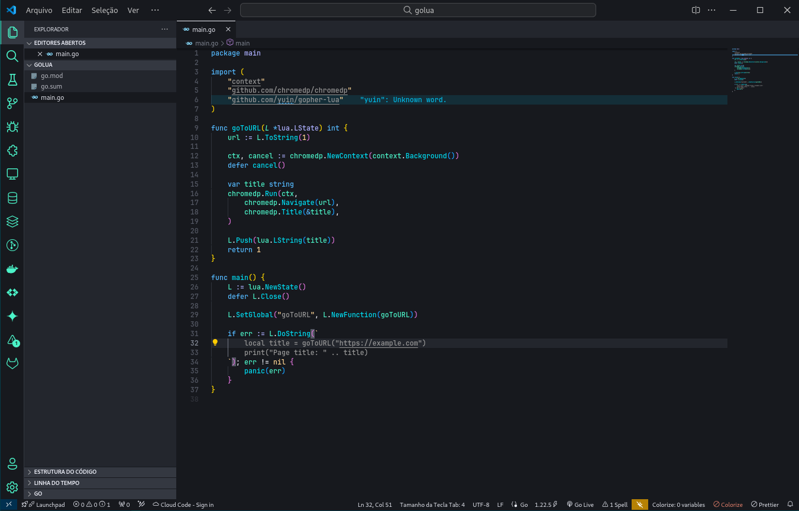

# Night Wave

Immerse yourself in a tranquil coding environment with this Visual Studio Code theme, expertly crafted to blend cool blues, refreshing mint greens, and soft purples. The color scheme is designed to reduce eye strain, promoting a calming and focused atmosphere for extended coding sessions. Whether you're working late into the night or powering through a busy day, the gentle transitions between these hues provide a visually appealing and comfortable experience. This theme brings a sense of balance and serenity to your workspace, making it ideal for developers who seek both aesthetics and functionality in their coding environment.

## Issues

If you have any, please open an issue in our repository (https://github.com/raykavin/night-wave/issues).